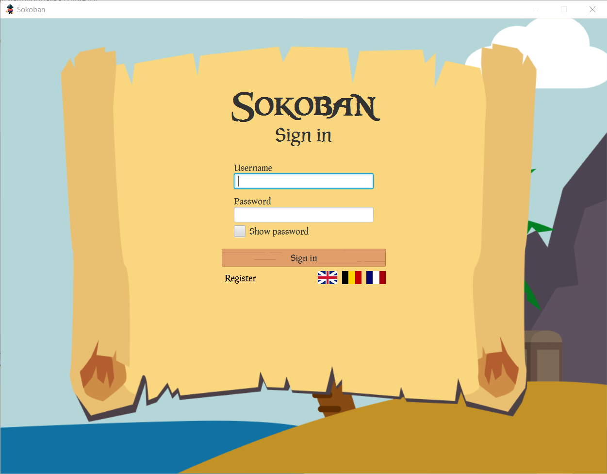
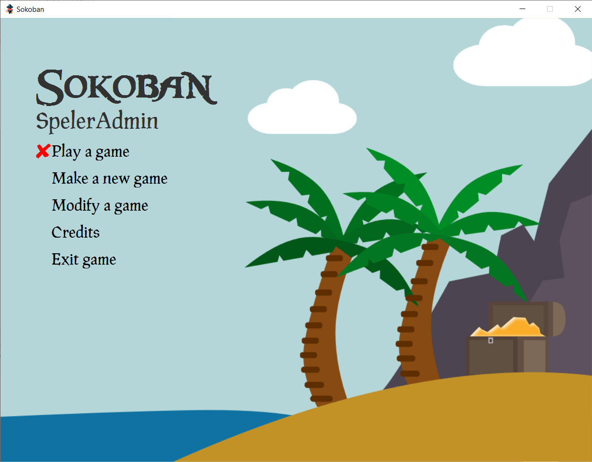
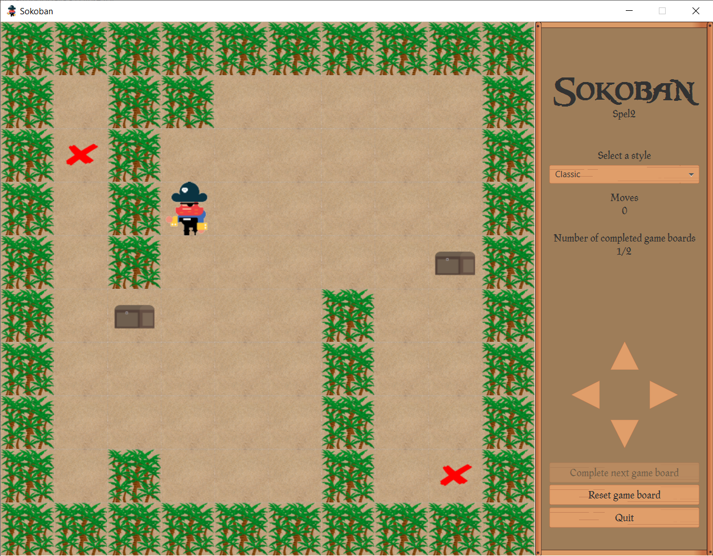
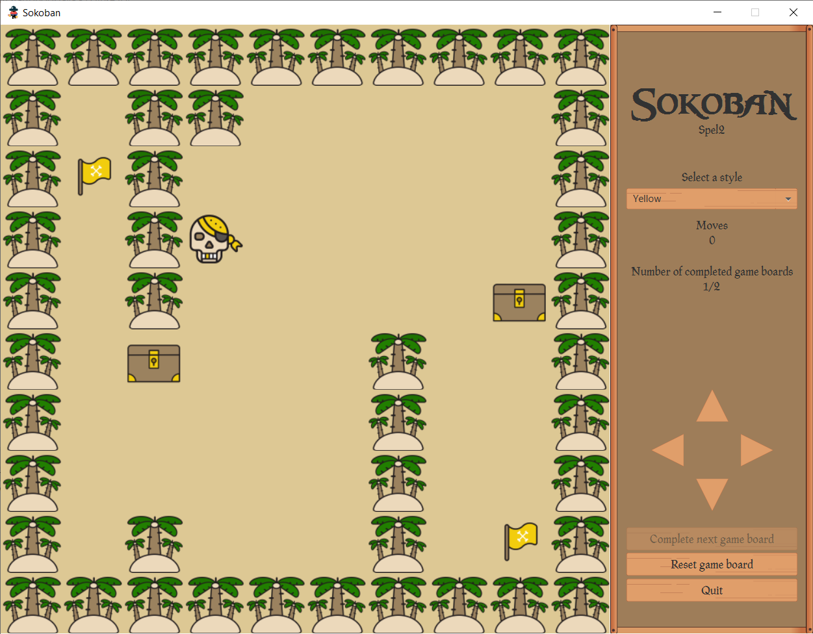
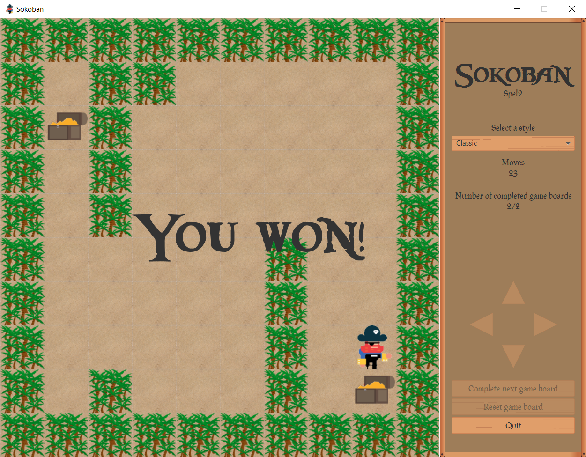
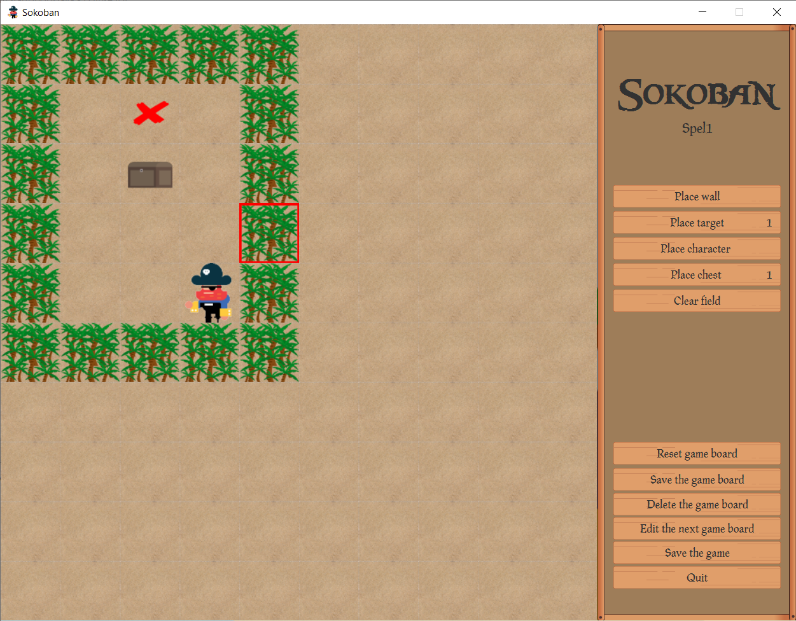

# HoGent-Sokoban

A project made for the course Projecten-workshops I at HoGent. The goal was to design and code the game Sokoban in Java.

## Pre-Run

Run [DBInitializer.sql](sql/DBInitializer.sql) in MySQL Workbench

Configure Build Path (Module Path)
- Add JUnit 5
- Add [JavaFX](https://gluonhq.com/products/javafx/)
- Add [MySQL Connector](jars/modulepath/mysql-connector-java-8.0.22.jar)

## Logins

| Username    | Pasword  | Contents      |
| :---------- | :------- | :------------ |
| Speler00    | Pa123456 | Normal player |
| SpelerAdmin | Pa123456 | Admin         |

## Screenshots

