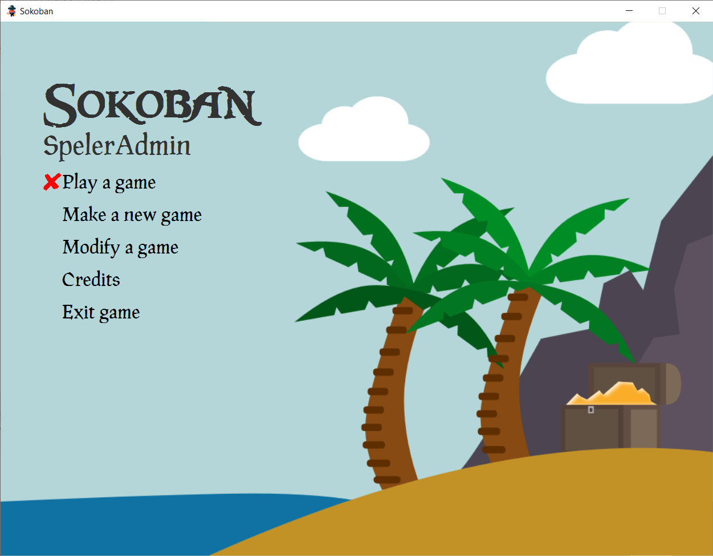
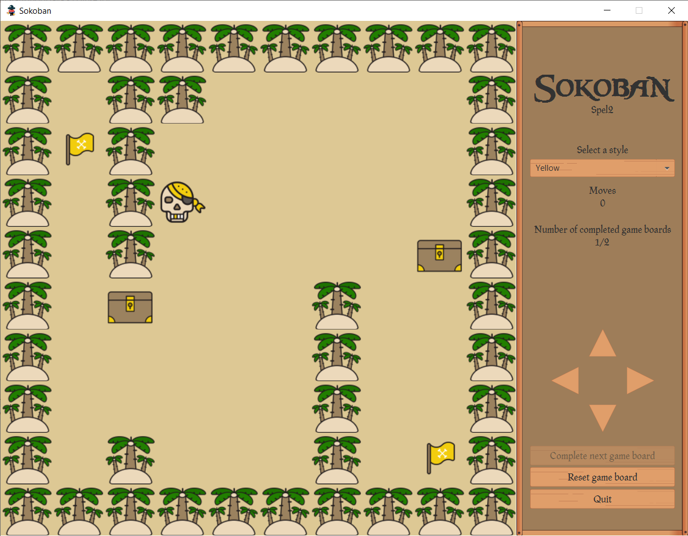
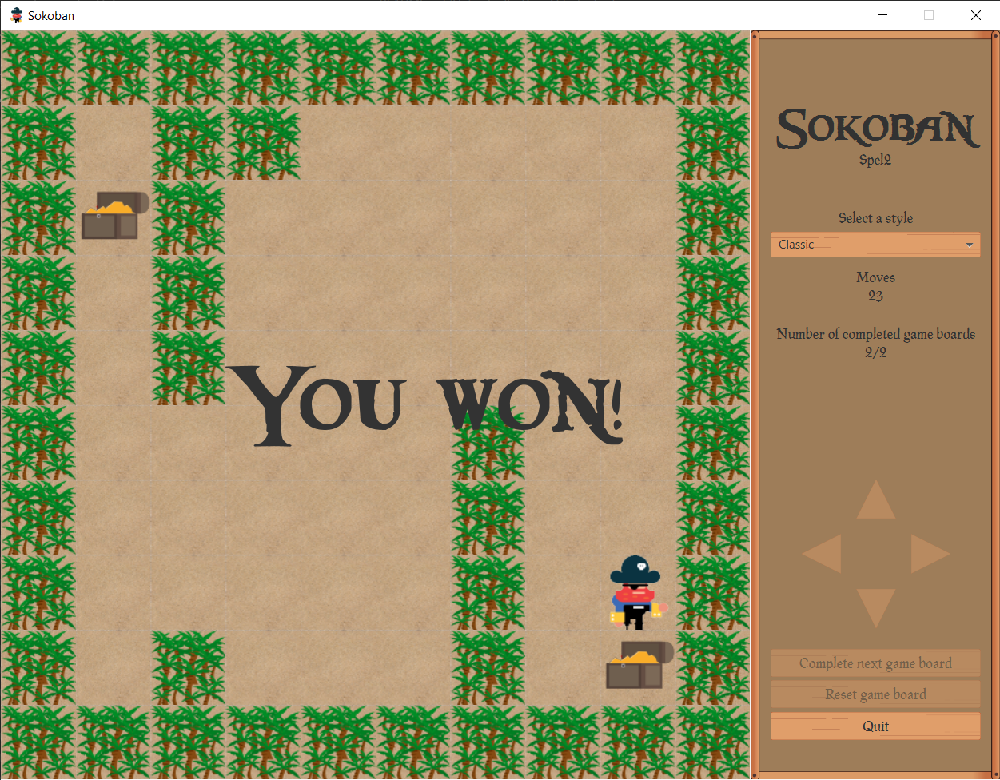
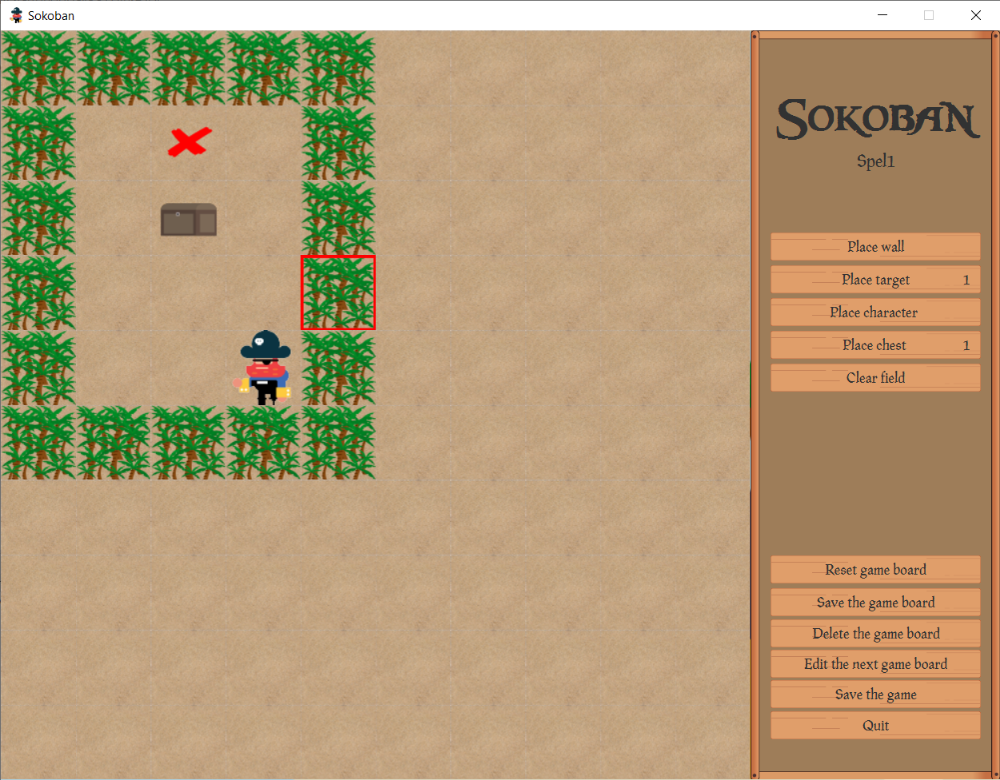

# HoGent-Sokoban
A project made for the course Projecten-workshops I at HoGent. The goal was to design and code the game Sokoban in Java.

## Setup
### MySQL
- Run [MySQLDBInitializer.sql](sql/MySQLDBInitializer.sql) in MySQL Workbench
- Uncomment the MySQL connection string in `Connectie.java`

### MSSQL
- Check if SQL Server and Windows Authentication are enabled, [Login failed for user sa](https://www.yazilimkodlama.com/sql-server-2/sql-server-18456-hatasi-cozumu-login-failed-for-user-sa/)
- Check if TCP/IP connections are enabled, [TCP/IP connection to host failed](https://stackoverflow.com/a/18850073/8807613)
- Check if `sa` user exists in database with same password as in JDBC connection string in `Connectie.java`
- Uncomment the MSSQL connection string in `Connectie.java`
- Run [MSSQLDBInitializer.sql](sql/MSSQLDBInitializer.sql) in SQL Server management studio

## Logins

| Username    | Pasword  | Contents      |
| :---------- | :------- | :------------ |
| Speler00    | Pa123456 | Normal player |
| SpelerAdmin | Pa123456 | Admin         |

## Create jar
Run `Build Artifacts` step

## Screenshots

